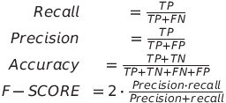

### Reporte bisemanal 02-05-2021
### Autor:  Pablo Cheng Galdamez 
### Carne: B72182 

* ## Resumen de los temas
    * Limpieza de datos con python, aquí se refiere a como podemos leer *datasets*. De igual manera manipularlos para limpiar y obtener la información requerida. En este proceso nos podemos basar en distribuciones estadísticas y determinar qué tan valioso es para la investigación un determinado dato. También podemos identificar los valores duplicados que pueda tener el *dataset* y borrar estos datos.
    * Modelos y algoritmo.El algoritmo es un procedimiento en el que se trata con el *dataset*, tanto reconociendo patrones o aprendiendo de este.El resultado de un algoritmo es un modelo. Existen varios tipos de algoritmos, tales como:
        * Clasificación: árboles de decisión
        * Regresión: regresiones lineales, árboles de decisión
        * Segmentacion (clustering): k-means, DBSCAN
    * Modelar. Un modelo trata de resumir la información de un *dataset*, en la que pueda hacer cierto tipo de predicciones. Si el modelo no puede predecir o aproximarse al mundo real, este no sirve. En estos casos podemos tratar de limpiar aún más el *dataset*, o elegir otro algoritmo más adecuado al modelo.

        &nbsp;&nbsp;&nbsp;&nbsp;Una vez elegido el modelo, este se debe ajustar a los datos. Típicamente mientras más sencillo sea un modelo de explicar, mejor. Sin embargo esto no aplica para todos los problemas, existen modelos que no pueden ser descritos de una manera más sencilla, sino más bien deben ser más complejos, con aún más variables. Cabe recalcar que cuando se utilizan modelos muy complejos, se corre con el riesgo de producir *overfit*. El *overfit* se da cuando el modelo se termina aprendiendo todo el *dataset* y no logra hacer inferencias con datos nuevos.
        
        &nbsp;&nbsp;&nbsp;&nbsp;Existe un *trade off* entre qué tan certero es el modelo y simplicidad, mientras más sencillo, más fácil y entendible es, sin embargo otro más complejo puede lograr el cometido, cuando uno simple no.

    * Bias-variance trade offs.
        
        &nbsp;&nbsp;&nbsp;&nbsp;El cesgo son errores a partir de supuestos incorrectos. Mientras que la varianza son errores de los datos, cuando tienden a ser muy variados. 

        &nbsp;&nbsp;&nbsp;&nbsp;Los errores dados por el sesgo producen *underfit*. Cuando se habla de *underfit* se refiere cuando los resultados del modelo son malos debido al poco entrenamiento.

        &nbsp;&nbsp;&nbsp;&nbsp;Los errores producto de la varianza, tienden a producir *overfit*. Dado a que el modelo se ajusta muy bien al ruido.
    * Modelos lineales vs no lineales

        &nbsp;&nbsp;&nbsp;&nbsp;Un modelo lineal se basa en pesos y tienden a ser de fácil comprensión y de construir. Sin embargo, pocos problemas se pueden resolver con estos modelos. Las alternativas son los modelos no lineales, tales como logaritmos, exponenciales o polinomiales.

    * Modelos de caja negra vs descriptivos

        &nbsp;&nbsp;&nbsp;&nbsp;Los controles de caja negra tienden a ser muy efectivos, pero se desconoce qué está pasando por dentro.  Mientras que los modelos descriptivos son fácilmente visualizables, y muy entendibles.
    
    * *First Principle* vs *Data Driven*

        &nbsp;&nbsp;&nbsp;&nbsp;Los modelos *first principle* se basan en una creencia general acerca de lo que hacen. De igual manera en cálculos matemáticos, como heurísticas. Mientras que los basados en datos se basan en correlaciones que hayan en el *dataset*

    * Evaluación de un modelo

        &nbsp;&nbsp;&nbsp;&nbsp;Lo primero que debemos hacer es separar el *dataset*, comúnmente en 3 partes. Dado que se necesita entrenar, evaluar y probar el modelo.

        * Entrenamiento, *dataset* para entrenar el modelo
        * Validación, evalúa el modelo para ajustarlo
        * *Test*, prueba las predicciones del modelo

        &nbsp;&nbsp;&nbsp;&nbsp;Generalmente se utiliza la proporción 60/20/20 respectivamente, dado que esto proporciona que el modelo se pueda entrenar con gran cantidad de datos, y también se puede probar con datos completamente nuevos. 

    * Validación cruzada

        &nbsp;&nbsp;&nbsp;&nbsp;Se aplica este método cuando se tiene un *dataset* muy pequeño. Consta en separar el *dataset* en x cantidad de bloques, e ir iterando entre sí. Luego de realizar un entrenamiento y test, se vuelve a crear otros bloques y se vuelve a correr lo mismo, hasta x veces. Se unifica el entrenamiento con la validación .

    * *Binary Classifiers*

        &nbsp;&nbsp;&nbsp;&nbsp;Esto se da cuando se está probando el modelo, existen 4 posibles resultados. El modelo puede predecir correctamente la clase, tanto si pertenece o no, determinado por la matriz de identidad. También puede clasificar erróneamente lo que serían las restantes opciones. 
        |       | Predicted Yes |Predicted No |
        | ----------- | ----------- | ----------- |
        | Actual Yes  | True Positive       | False Negative       |
        | Actual No   | False Positive  | True Negative|

        &nbsp;&nbsp;&nbsp;&nbsp;A partir de esta clasificación se pueden formar métricas de calidad, que ayudan a determinar que tan bueno es un modelo. Una de estas mediciones es el *recall*, determina cuántos fueron positivos sobre todos los que esperaba que lo fueran. Luego está la precisión que determina lo que yo esperaba y el modelo no logró clasificar bien, contra todos los que me dio. 

        

* ## Comentarios
    &nbsp;&nbsp;&nbsp;&nbsp;Aprendí bastante acerca de las múltiples tipos de modelos que pueden haber, y que no todos sirven para un mismo *dataset*. Tambien me parecio muy util las mediciones que se hacen sobre un modelo para determinar qué tan bueno pudo ser. 
* ## Dudas
    &nbsp;&nbsp;&nbsp;&nbsp;No me quedo tan claro la distinción entre la validación del modelo y el *test*.
* ## Posible uso
    &nbsp;&nbsp;&nbsp;&nbsp;El uso de modelos en la el ambiente laboral puede llegar a ser indispensable, dado que hay mucha información en cada sistema. También cada vez más el rumbo de la tecnología se dirige a la automatización de las cosas, por ende se deben crear modelos que sustituyan a una persona de la mejor manera. 
* ## Material extra
    

